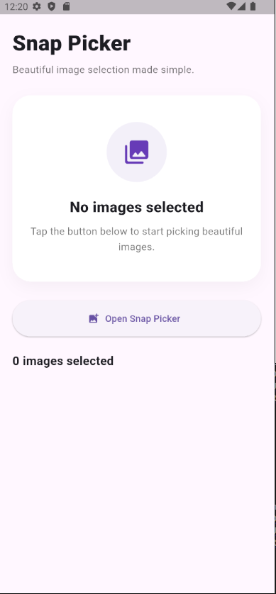

# 📸 Snap Picker

> A beautiful animated image picker for Flutter with modern UI, smooth interactions, gallery preview, upload flow, and immersive image experience.

<p>
   
  
</p>
<p>
  
</p>

---

## ✨ Features

- 📸 Custom Gallery Picker
- 🎞️ Video Support
- 🎥 Camera Support
- 🖼️ Multi Image Selection
- 📱 Draggable Bottom Sheet
- ✨ Smooth Selection Animation
- 🔍 Full Screen Image Preview
- 🤏 Zoom Support
- 🔄 Swipe Preview
- 🗑️ Remove Selected Images
- 📤 Upload Progress UI
- ✅ Upload Success State
- 🎨 Modern Premium UI
- 🌙 Dark Mode Friendly


---

# 🚀 Installation

Add this to your `pubspec.yaml`:

```yaml
dependencies:
    snap_picker: ^1.1.0
```

Then run:

```bash
flutter pub get
```

---

# 📦 Import

```dart
import 'package:snap_picker/snap_picker.dart';
```

---

# ⚡ Usage

```dart
SnapPicker.show(
  context,
  allowMultiple: true,
  maxSelection: 5,
  onImagesSelected: (images) {
    print(images.length);
  },
);
```

---

# 🖼️ Preview Grid

```dart
SnapPickerPreview(
  images: selectedImages,
  onRemove: removeImage,
)
```

---

# ✨ Full Screen Preview

* Tap on any selected image
* Swipe between images
* Zoom support included

---


# 🎯 Why Snap Picker?

Most image picker packages are:

* basic
* outdated
* boring

Snap Picker focuses on:

* beautiful UI
* smooth UX
* premium interactions
* modern Flutter design

---

# 🔥 Upcoming Features

* 🫧 Gooey Selection Animation
* 🔄 Reorder Images
* 📂 Album Selector
* 🎨 Full Theme Customization
* 🌈 Glassmorphism Mode
* ⚡ Faster Lazy Loading
* 📤 Real Upload Integration

---

# 🤝 Contributing

Contributions are welcome!

If you have ideas, improvements, or animations to add, feel free to open an issue or pull request.

---

# ❤️ Support

If you like this package, give it a ⭐ on GitHub and share it with Flutter developers.

---

# 📜 License

MIT License © 2026

# ⭐ Check out Snap Picker on pub.dev and GitHub:

📦 https://pub.dev/packages/snap_picker <br>
💻 https://github.com/Sakshi-2508/snap_picker
